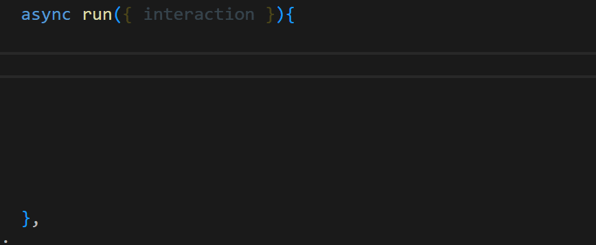
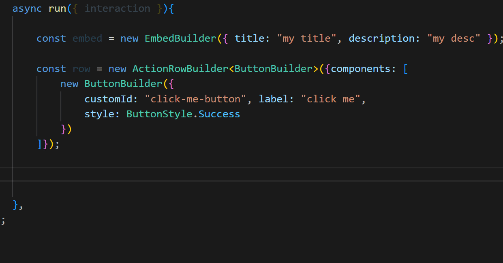

# Discord.js Code Snippets v14

Simple code snippets for discord.js v14

 | 
| --- | --- |
 | 

| Name             | Prefix              | Description                         |
|------------------|----------------|------------------------------------------|
| New Button | `new.button.djs` | Create a new Button |
| New StringSelect | `new.stringselect.djs` | Create a new String Select |
| New Modal | `new.modal.djs` | Create a new Modal |
| New ActionRow | `new.actionrow.djs` | Create a new ActionRow |
| New TextInput | `new.textinput.djs` | Create a new TextInput |
| New Simple Embed | `new.embed.simple.djs` | Create a new simple embed |
| New Normal Embed | `new.embed.normal.djs` | Create a new normal embed |
| New Complete Embed | `new.embed.complete.djs` | Create a new complete embed |
| New Full Embed | `new.embed.full.djs` | Create a new full embed |
| | | |
| Reply Content | `reply.content.djs` | Setup a content interaction reply |
| Reply Embeds | `reply.embeds.djs` | Setup a embeds interaction reply |
| Reply Embeds and Components | `reply.embeds.components.djs` | Setup a embeds and components interaction reply  |
| Reply Content and Components | `reply.content.components.djs` | Setup a content and components interaction reply |
| Reply Embeds and Files | `reply.embeds.files.djs` | Setup a embeds and files interaction reply |
| Reply Complete | `reply.complete.djs` | Setup a complete interaction reply |
| | | |
| Create a Button Collector | `collector.button.djs` | Create a button collector |
| Create a SelectMenu Collector | `collector.selectmenu.djs` | Create a selectmenu collector |
| Create a Message Collector | `collector.message.djs` | Create a message collector |
| | | |
| Await a Button Interaction | `await.button.djs` | Await a button interaction |
| Await a SelectMenu Interaction | `await.selectmenu.djs` | Await a selectmenu Interaction |
| Await a Message | `await.message.djs` | Await a message Interaction |
| Await a Modal Interaction | `await.modal.djs` | Await a modal interaction |

[My github](https://github.com/rinckonobre)
## Feedback and Questions

Join on my discord: [Zunder Community](http://discord.gg/tTu8dGN)